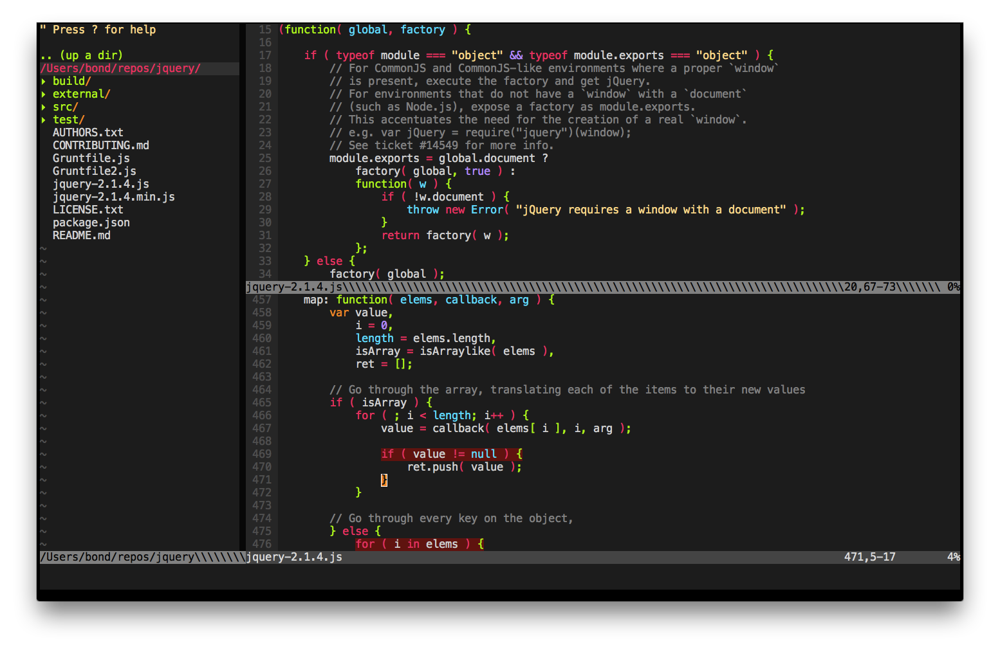

# web 前端专用 vim 配置
- 要漂亮, 要漂亮, 要漂亮, 三遍完;
- 一点一点改中, :cupid:;

# 主要更新 [详细](update_log_shrekuu.md)
- 已 [molokai](https://github.com/tomasr/molokai) 为默认高亮主题;
- 修改 `fi` 为使用默认浏览器打开由 markdown 生成的 html 文件 :heart:;

运行截图: 

以下为原仓库 README.md 内容, 感谢分享;

---

# 超强vim配置文件

### 运行截图

### 简易安装方法：

打开终端，执行下面的命令就自动安装好了：

`wget -qO- https://raw.github.com/ma6174/vim/master/setup.sh | sh -x`

### 或者自己手动安装：(以ubuntu为例)

1. 安装vim `sudo apt-get install vim`
- 安装ctags：`sudo apt-get install ctags`
- 安装一些必备程序：`sudo apt-get install xclip vim-gnome astyle python-setuptools`
- python代码格式化工具：`sudo easy_install -ZU autopep8`
- `sudo ln -s /usr/bin/ctags /usr/local/bin/ctags`
- clone配置文件：`cd ~/ && git clone git://github.com/ma6174/vim.git`
- `mv ~/vim ~/.vim`
- `mv ~/.vim/.vimrc ~/`
- clone bundle 程序：`git clone https://github.com/gmarik/vundle.git ~/.vim/bundle/vundle`
- 打开vim并执行bundle程序`:BundleInstall`
- 重新打开vim即可看到效果

### 了解更多vim使用的小技巧：

[tips.md](tips.md)

### 查看更新日志：

[`update_log.md`](update_log.md)
